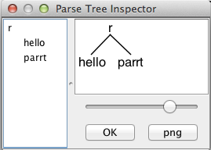

# Getting Started with ANTLR v4

嗨,欢迎来到ANTLR第4版!它以[Crazy Nasty-Ass Honey Badger](http://www.youtube.com/watch?v=4r7wHMg5Yjg)的无所畏惧的英雄命名,因为ANTLR v4会接受您提供的所有内容,但不会废话!请参阅[我们为什么需要ANTLR v4?](faq/general.md)和[ANTLR v4书的序言](http://media.pragprog.com/titles/tpantlr2/preface.pdf)。

## Installation

ANTLR实际上有两件事:一种将语法转换为Java(或其他目标语言)的解析器/词法分析器的工具,以及生成的解析器/词法分析器所需的运行时。即使您使用ANTLR Intellij插件或ANTLRWorks来运行ANTLR工具,生成的代码仍将需要运行时库。

您应该做的第一件事可能是下载并安装开发工具插件。即使仅使用此类工具进行编辑,它们也很棒。然后,按照以下说明操作,以使系统可以使用运行时环境来运行生成的解析器/词法分析器。在接下来的内容中,我将讨论antlr-4.7.1-complete.jar,该文件具有工具,运行时以及其他任何支持库(例如,ANTLR v4是用v3编写的)。

如果要使用mvn,ant或将ANTLR集成到IDE(例如eclipse或intellij)中,或者将ANTLR集成到现有的构建系统中,请参阅将ANTLR集成到开发系统中。

### UNIX

0.安装Java(1.6版或更高版本)
1.下载
```
$ cd /usr/local/lib
$ curl -O https://www.antlr.org/download/antlr-4.7.1-complete.jar
```
或只是从网站的浏览器中下载:
    [https://www.antlr.org/download.html](https://www.antlr.org/download.html)
并将其放在合理的位置,例如`/usr/local/lib`

2.将`antlr-4.7.1-complete.jar`添加到您的`CLASSPATH`:
```
$ export CLASSPATH=".:/usr/local/lib/antlr-4.7.1-complete.jar:$CLASSPATH"
```
将其放入您的`.bash_profile`或任何启动脚本中也是一个好主意。

3.为ANTLR工具和`TestRig`创建别名。
```
$ alias antlr4='java -Xmx500M -cp "/usr/local/lib/antlr-4.7.1-complete.jar:$CLASSPATH" org.antlr.v4.Tool'
$ alias grun='java -Xmx500M -cp "/usr/local/lib/antlr-4.7.1-complete.jar:$CLASSPATH" org.antlr.v4.gui.TestRig'
```

### WINDOWS

(*感谢Graham Wideman *)

0.安装Java(1.6版或更高版本)
1.从[https://www.antlr.org/download/](https://www.antlr.org/download/)下载antlr-4.7.1-complete.jar(或任何版本)
保存到第三方Java库的目录中,例如`C:\Javalib`
2.将`antlr-4.7.1-complete.jar`添加到CLASSPATH,或者:
  *永久:使用“系统属性”对话框>环境变量>创建或附加到`CLASSPATH`变量
  *在命令行临时:
```
SET CLASSPATH=.;C:\Javalib\antlr-4.7.1-complete.jar;%CLASSPATH%
```
3.使用批处理文件或doskey命令为ANTLR工具和TestRig创建简短的便捷命令:
  *批处理文件(在系统PATH中的目录中)antlr4.bat和grun.bat
```
java org.antlr.v4.Tool %*
```
```
@ECHO OFF
SET TEST_CURRENT_DIR=%CLASSPATH:.;=%
if "%TEST_CURRENT_DIR%" == "%CLASSPATH%" ( SET CLASSPATH=.;%CLASSPATH% )
@ECHO ON
java org.antlr.v4.gui.TestRig %*
```
  *或者,使用doskey命令:
```
doskey antlr4=java org.antlr.v4.Tool $*
doskey grun =java org.antlr.v4.gui.TestRig $*
```

###测试安装

直接启动org.antlr.v4.Tool:

```
$ java org.antlr.v4.Tool
ANTLR Parser Generator Version 4.7.1
-o ___ specify output directory where all output is generated
-lib ___ specify location of .tokens files
...
```

或在Java上使用-jar选项:

```
$ java -jar /usr/local/lib/antlr-4.7.1-complete.jar
ANTLR Parser Generator Version 4.7.1
-o ___ specify output directory where all output is generated
-lib ___ specify location of .tokens files
...
```

## A First Example

在一个临时目录中,将以下语法放入文件Hello.g4中:
你好.g4

```
//Define a grammar called Hello
grammar Hello;
r  : 'hello' ID ;         //match keyword hello followed by an identifier
ID : [a-z]+ ;             //match lower-case identifiers
WS : [ \t\r\n]+ -> skip ; //skip spaces, tabs, newlines
```

然后在其上运行ANTLR工具:

```
$ cd /tmp
$ antlr4 Hello.g4
$ javac Hello*.java
```

现在测试一下:

```
$ grun Hello r -tree
(Now enter something like the string below)
hello parrt
(now,do:)
^D
(The output:)
(r hello parrt)
(That ^D means EOF on unix; it's ^Z in Windows.) The -tree option prints the parse tree in LISP notation.
It's nicer to look at parse trees visually.
$ grun Hello r -gui
hello parrt
^D
```

这会弹出一个对话框,显示规则`r`与关键字`hello`相匹配,后跟标识符`parrt`。



## Book source code

这本书有很多例子,它们也应该很有用。您可以在此处免费下载它们:

[http://pragprog.com/titles/tpantlr2/source_code](http://pragprog.com/titles/tpantlr2/source_code)

另外,github上有大量针对v4的语法集合:

[https://github.com/antlr/grammars-v4](https://github.com/antlr/grammars-v4)