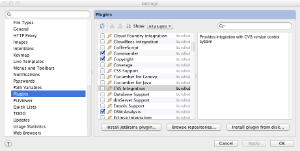
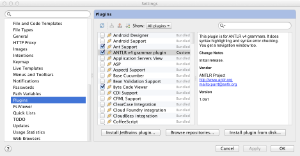

# Java

## Development environments

### Intellij

有一个非常完整且有用的intellij 12-14插件,您可以在[下载页面](https://plugins.jetbrains.com/plugin/7358?pr=)上获取。检查[插件自述文件](https://github.com/antlr/intellij-plugin-v4)中的功能集。只需转到首选项,然后在此对话框中单击“从磁盘安装插件...”按钮:



选择intellij-plugin-1.x.zip(或任何版本)文件,然后单击确定或应用。它将要求您重新启动IDE。如果再次查看这些插件,将会看到:



另外,我还准备了一个[video](https://youtu.be/eW4WFgRtFeY),它将帮助您生成语法,等等,以便在Intellij中使用ANTLR v4(不带插件)。

### Eclipse

埃德加·埃斯皮纳(Edgar Espina)创建了[用于ANTLR v4的日食插件](https://marketplace.eclipse.org/content/antlr-ide)。功能:高级语法突出显示,自动代码生成(保存),手动代码生成(通过“外部工具”菜单),代码格式化程序(Ctrl + Shift + F),语法图,文件之间的高级规则导航(F3),快速修复。

### NetBeans

Sam Harwell的[ANTLRWorks2](http://tunnelvisionlabs.com/products/demo/antlrworks)也可以作为插件使用,而不仅仅是基于NetBeans构建的独立工具。

## Build systems

### ant

### mvn

*《 Maven插件参考》 *

可以在以下位置找到最新版本的ANTLR 4 Maven插件的参考页:

[http://www.antlr.org/api/maven-plugin/latest/index.html](http://www.antlr.org/api/maven-plugin/latest/index.html)

*演练*

本节介绍如何创建一个简单的Antlr 4项目并使用maven进行构建。我们将使用本书第3章中的ArrayInit.g4示例,并将其引入Maven。我们将需要重命名文件并对其进行修改。我们将通过构建一个便携式独立应用程序来结束。

生成骨架。要生成Maven骨架,请键入以下命令:

```bash
mkdir SimpleAntlrMavenProject
cd SimpleAntlrMavenProject
mvn archetype:generate -DgroupId=org.abcd.examples -DartifactId=array-example -Dpackage=org.abcd.examples.ArrayInit -Dversion=1.0
# Accept all the default values
cd array-example
```

Maven会提出一系列问题,只需按回车键即可接受默认答案。

移至由maven创建的目录:

```bash
cd array-example
```

我们可以使用find命令查看由maven创建的文件:

```bash
$ find . -type f
./pom.xml
./src/test/java/org/abcd/examples/ArrayInit/AppTest.java
./src/main/java/org/abcd/examples/ArrayInit/App.java
```

我们需要大量编辑pom.xml文件。App.java将重命名为ArrayInit.java,并将包含主要的ANTLR Java程序,我们将从本书示例中下载该程序。AppTest.java文件将重命名为ArrayInitTest.java,但仍将保留由maven创建的空测试。我们还将在其中的书籍示例中添加语法文件ArrayInit.g4。

获取该书的示例,并将其放入“下载”文件夹中。要从本书中获取ArrayInit.g4语法,只需下载即可:

```bash
pushd ~/Downloads
wget http://media.pragprog.com/titles/tpantlr2/code/tpantlr2-code.tgz
tar xvfz tpantlr2-code.tgz
popd
```

将语法复制到Maven项目。语法文件进入src /目录下的特殊文件夹。文件夹名称必须与Maven包名称org.abcd.examples.ArrayInit相匹配。

```bash
mkdir -p src/main/antlr4/org/abcd/examples/ArrayInit
cp ~/Downloads/code/starter/ArrayInit.g4 src/main/antlr4/org/abcd/examples/ArrayInit
```

将主程序复制到Maven项目。我们用书中的主要Java程序替换了maven App.java文件。在这本书中,该主程序称为Test.java,我们将其重命名为ArrayInit.java:

```bash
# Remove the maven file
rm ./src/main/java/org/abcd/examples/ArrayInit/App.java
# Copy and rename the example from the book
cp ~/Downloads/code/starter/Test.java ./src/main/java/org/abcd/examples/ArrayInit/ArrayInit.java
```

花几分钟阅读主程序。注意,它读取标准输入流。运行应用程序时,我们需要记住这一点。

编辑ArrayInit.java文件。我们需要添加一个包声明并重命名该类。在您喜欢的编辑器中编辑文件./src/main/java/org/abcd/examples/ArrayInit/ArrayInit.java。完成后,文件头应如下所示:

```java
package org.abcd.examples.ArrayInit;
import org.antlr.v4.runtime.*;
import org.antlr.v4.runtime.tree.*;
 
public class ArrayInit {
...
```

编辑ArrayInitTest.java文件。Maven创建了一个名为AppTest.java的测试文件,我们需要对其进行重命名以匹配应用程序的名称:

```bash
pushd src/test/java/org/abcd/examples/ArrayInit
mv AppTest.java ArrayInitTest.java
sed 's/App/ArrayInit/g' ArrayInitTest.java >ArrayInitTest.java.tmp
mv ArrayInitTest.java.tmp ArrayInitTest.java
popd
```

编辑pom.xml文件。现在,我们需要大量修改pom.xml文件。最终产品如下所示:

```xml
<project xmlns="http://maven.apache.org/POM/4.0.0" xmlns:xsi="http://www.w3.org/2001/XMLSchema-instance"
  xsi:schemaLocation="http://maven.apache.org/POM/4.0.0 http://maven.apache.org/xsd/maven-4.0.0.xsd">
  <modelVersion>4.0.0</modelVersion>
  <groupId>org.abcd.examples</groupId>
  <artifactId>array-init</artifactId>
  <version>1.0</version>
  <packaging>jar</packaging>
  <name>array-init</name>
  <url>http://maven.apache.org</url>
  <properties>
    <project.build.sourceEncoding>UTF-8</project.build.sourceEncoding>
  </properties>
  <dependencies>
    <dependency>
      <groupId>org.antlr</groupId>
      <artifactId>antlr4-runtime</artifactId>
      <version>4.5</version>
    </dependency>
    <dependency>
      <groupId>junit</groupId>
      <artifactId>junit</artifactId>
      <version>3.8.1</version>
    </dependency>
  </dependencies>
  <build>
    <plugins>
      <!-- This plugin sets up maven to use Java 7 -->
      <plugin>
        <groupId>org.apache.maven.plugins</groupId>
        <artifactId>maven-compiler-plugin</artifactId>
        <version>3.1</version>
        <configuration>
          <source>1.7</source>
          <target>1.7</target>
        </configuration>
      </plugin>
      <!-- Plugin to compile the g4 files ahead of the java files
           See https://github.com/antlr/antlr4/blob/master/antlr4-maven-plugin/src/site/apt/examples/simple.apt.vm
           Except that the grammar does not need to contain the package declaration as stated in the documentation (I do not know why)
           To use this plugin, type:
             mvn antlr4:antlr4
           In any case, Maven will invoke this plugin before the Java source is compiled
        -->
      <plugin>
        <groupId>org.antlr</groupId>
        <artifactId>antlr4-maven-plugin</artifactId>
        <version>4.5</version>
        <executions>
          <execution>
            <goals>
              <goal>antlr4</goal>
            </goals>
          </execution>
        </executions>
      </plugin>
      <!-- plugin to create a self-contained portable package
           This allows us to execute our application like this:
           java -cp target/array-init-1.0-jar-with-dependencies.jar org.abcd.examples.ArrayInit.ArrayInit
         -->
      <plugin>
        <artifactId>maven-assembly-plugin</artifactId>
        <configuration>
          <descriptorRefs>
            <descriptorRef>jar-with-dependencies</descriptorRef>
          </descriptorRefs>
        </configuration>
        <executions>
          <execution>
            <id>simple-command</id>
            <phase>package</phase>
            <goals>
              <goal>attached</goal>
            </goals>
          </execution>
        </executions>
      </plugin>
    </plugins>
  </build>
</project>
```

总结了我们必须进行的更改。我们可以使用find命令查看我们拥有的文件列表:

```bash
$ find . -type f
./pom.xml
./src/test/java/org/abcd/examples/ArrayInit/ArrayInitTest.java
./src/main/antlr4/org/abcd/examples/ArrayInit/ArrayInit.g4
./src/main/java/org/abcd/examples/ArrayInit/ArrayInit.java
```

构建一个独立的应用程序。现在所有文件都准备就绪,我们可以要求maven创建一个独立的应用程序。下面的命令执行此操作:

```bash
mvn package
```

Maven创建了一个独立的jar文件,名为target/array-init-1.0-jar-with-dependencies.jar。我们可以执行jar文件,但是请记住,它需要在命令行中输入一些内容,这意味着该命令将挂在命令行上,直到我们将其输入以下内容为止:

```bash
java -cp target/array-init-1.0-jar-with-dependencies.jar org.abcd.examples.ArrayInit.ArrayInit
```

让我们输入以下输入:

```bash
{1,2,3}
^D
```

^ D将输入的结束信号发送到标准输入流,并使应用程序的其余部分继续运行。您应该看到以下输出:

```bash
(init { (value 1) , (value 2) , (value 3) })
```

您还可以构建没有依赖项的jar文件,并使用maven命令代替执行它:

```bash
mvn install
mvn exec:java -Dexec.mainClass=org.abcd.examples.ArrayInit.ArrayInit
{1,2,3}
^D
```